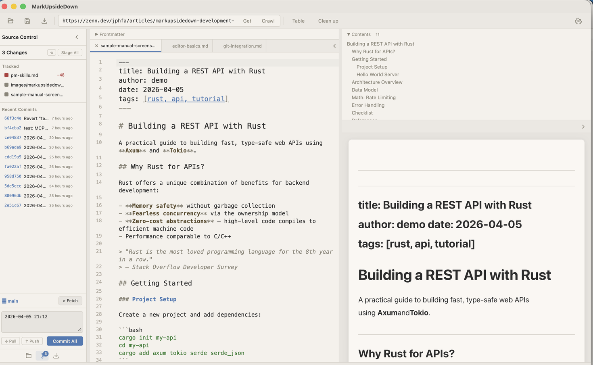

# Git Integration

MarkUpsideDown has a built-in Git panel for common version control operations. You can view changes, stage files, commit, push, and pull — all without leaving the app.

## Opening the Git Panel

Click the **Git** icon in the sidebar's bottom navigation bar, or switch from the Files panel. The Git panel appears in the sidebar.



If no folder is open, the panel shows "Open a folder to see git status." If the folder is not a Git repository, it offers an **Initialize Repository** button.

## Viewing Changes

The Git panel shows three sections:

### Staged Files

Files that are ready to be committed. Each file row shows:

- **Status badge** — color-coded letter (M for modified, A for added, D for deleted, R for renamed)
- **Filename**
- **Diff stats** — additions and deletions (e.g., +12 −3)
- **Unstage button** — click to move the file back to unstaged

### Unstaged Files

Files with changes that are not yet staged. In addition to the same info as staged files, each row has:

- **Stage button** — click to stage the file
- **Discard button** (⟲) — revert the file to its last committed state

At the top, **"Stage All"** and **"⟲ Discard All"** buttons operate on all unstaged files.

### Inline Diff

Click any file row to expand an inline diff view below it. The diff shows added lines in green and removed lines in red, with hunk headers in gray.

## Committing

At the bottom of the Git panel:

1. Type your commit message in the textarea (a timestamp is pre-filled as a default)
2. Click **Commit** to commit staged files, or **Commit All** to stage and commit everything
3. Use **Cmd+Enter** as a shortcut while the commit message textarea is focused

A status message appears briefly after a successful commit (green) or an error (red).

## Push, Pull, and Fetch

The bottom bar shows:

- **Branch name** with the current branch
- **⟳ Fetch** button — fetch remote changes
- **↓ Pull** button — pull changes (shows a count badge when behind remote)
- **↑ Push** button — push changes (shows a count badge when ahead of remote)

## Recent Commits

Below the file list, the **Recent Commits** section shows recent commit history:

- Short hash
- Commit message (truncated)
- Relative time (e.g., "2 hours ago")
- **⟲ Revert** button to revert a commit

Click a commit row to expand a multi-file inline diff of that commit.

## Cloning a Repository

Switch to the **Clone** panel in the sidebar (clone icon in the bottom nav). Enter a repository URL (HTTPS or SSH) and click Clone. The repository is cloned and opened in the editor.


## GitHub Issues and Pull Requests

If the open project's `origin` remote points at GitHub, you can browse its issues and pull requests in the sidebar and edit them as ordinary Markdown documents.

### Requirements

This feature is built on the [GitHub CLI](https://cli.github.com/). Install it and sign in once:

```bash
brew install gh
gh auth login
```

MarkUpsideDown never stores a GitHub token of its own. It reuses whatever account `gh` is signed in as.

### Browsing

Click the **Issues & PRs** icon in the sidebar's bottom navigation bar, or run "Show GitHub Issues" from the command palette (<kbd>Cmd</kbd>+<kbd>K</kbd>).

The panel has:

- A toggle between **Issues** and **Pull Requests**
- A state filter: Open, Closed, or All
- A search box that accepts GitHub search syntax, for example `label:bug author:octocat`
- **⟳ Refresh** to re-fetch

If something is missing, the panel says why: no folder open, no GitHub remote, `gh` not installed, or not signed in.

### Editing

Click any row to open it in a tab. The document looks like this:

```markdown
---
title: Preview scroll sync drifts on long documents
state: open
author: octocat
labels: bug, priority: high
url: https://github.com/owner/repo/issues/42
---

The preview pane loses its position after…

<!-- markupsidedown:github-comments (read-only below this line) -->

### @alice · 2026-09-02 09:30

Any update?
```

Edit the `title:` line in the frontmatter and the body beneath it, then press <kbd>Cmd</kbd>+<kbd>S</kbd>. Both are pushed to GitHub. The status bar confirms the save.

### What is and is not editable

| Editable | Read-only |
|----------|-----------|
| Title (the `title:` frontmatter line) | Comments |
| Body | State, labels, assignees, milestones |

Everything below the comment marker is regenerated each time the item is loaded and is never sent back, so edits there are discarded. The remaining frontmatter keys are shown for context only; changing them has no effect.

Auto-save is deliberately not applied to these tabs. Nothing reaches GitHub until you save explicitly.

### Conflicts

If someone edits the body on GitHub after you opened it, saving is refused with a message asking you to reload. Close the tab and open the item again to pick up the newer version. New comments do not count as a conflict.

### Limitations

- Images cannot be attached. GitHub has no public upload API for issue attachments, so paste an image into the browser first and reference its URL.
- Creating issues and posting comments are not supported.
- The preview uses the app's own Markdown renderer, so a few GitHub-specific conveniences such as `#123` auto-linking and `@mention` links are shown as plain text.
